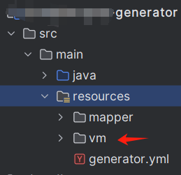
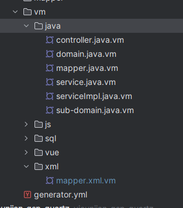

# ProblemNote
用以记录一些开发过程中遇到的问题


# 一、Java后端相关

## 1、对接第三方API

### 1.《医疗器械唯一标识管理信息系统数据共享API标准文档v3》

>[医疗器械唯一标识管理信息系统数据共享API标准文档]: https://udi.nmpa.gov.cn/showListInterr.html
>
>吐槽一下这个文档写的是真的垃圾，上面给出的返回字段类型都不对。本来根据这个破文档手动建实体类就够窝火了，返回时挨个挑错真的是想掀桌。

对于我们公司来说，常用的API就三个：`P001`、`P002`、`D003`

其中P接口用于测试连通和获取token，D003接口用以获取公司所需要的代码。 

### 2.支付宝相关API

### 3.微信相关API

## 2、考虑使用Redis作为消息队列（Redis Streams）

> 需要注意的是，如果没有创建消费者组，则不能使用`XACK`命令来清除已经使用`XADD`命令添加的stream键值对。此时需要`DEL`命令

MQ的维护成本太高，而且作为一个后端开发，虽然对Linux很感兴趣，但是完成不了开发任务也不是那么个事儿。

什么？你问运维呢？不好意思，从前端到后端，从开发到运维，从技术选型到实际落地，都是我自己。

```java
/**
  *代码还没写好呢。。。
  */
```

## 3、若依的一点东西

> 今天用若依框架的时候，生成出来的代码并不是很贴合我现在的开发，所以就查了查资料（问了问ChatGPT），发现还可以这么玩？所以就姑且记录一下。

### 1.若依的代码生成器

其实若依生成代码是有一套模板在的，就在`vm`包下。



`vm`包下包含了所有的模板类文件，若依已经帮我们分别整理好了。



```xml
<sql id="select${ClassName}Vo">
        select#foreach($column in $columns) ${tableAlias}.$column.columnName#if($foreach.count != $columns.size()),#end#end from ${tableName} ${tableAlias} 
    <!-- 使用表名的简写 -->
            left join sys_user u on ${tableAlias}.user_id = u.user_id
            left join sys_dept d on ${tableAlias}.dept_id = d.dept_id
</sql>
```

`mapper.xml.vm`文件中我主要是改了一下表连接，因为我的业务要求对所有数据权限进行统一管理，所以我给每条数据都绑定了`user_id`和`dept_id`（不得不说若依的RBAC是真的NICE，对我这种接近于独立开发的人来说省了大功夫了）

上面的代码中，我还添加了一个`tableAlias`也就是表别名和数据范围过滤的条件。需要在`VelocityUtils`类中修改`prepareContext`方法。获取表别名的方法也放出来（就随便一写，有改进方法可以交流一下）

```java
// 获取表名的简写
String tableAlias = extractAbbreviation(genTable.getTableName());


VelocityContext velocityContext = new VelocityContext();
// 将表名的简写添加到 VelocityContext
velocityContext.put("tableAlias", tableAlias);
velocityContext.put("dataScopePlaceholder", "<!-- 数据范围过滤 --> ${params.dataScope}");
/**
 * 将带有下划线的字符串提取简称
 * @param input 带有下划线的字符串
 * @return
 */
private static String extractAbbreviation(String input) {
    // 先将输入的字符串转为小写
    StringBuilder abbreviation = new StringBuilder();

    // 遍历输入的字符串
    boolean afterUnderscore = false;  // 标志位，表示是否遇到下划线之后
    for (int i = 0; i < input.length(); i++) {
        char currentChar = input.charAt(i);

        if (i == 0 || afterUnderscore) {  // 如果是第一个字符，或者遇到下划线后的第一个字符
            abbreviation.append(currentChar);  // 将字符添加到简称中
            afterUnderscore = false;  // 重置标志
        }

        // 判断是否遇到下划线
        if (currentChar == '_') {
            afterUnderscore = true;  // 设置标志位
        }
    }

    return abbreviation.toString();
}
```

另外在`controller.java.vm`中我在`list`方法上加了`@DataScope(deptAlias = "d",userAlias = "u")`用作数据范围过滤。这样基本上就可以达到我要的效果了。

### 2.用不到的ID Generator

写完才发现若依有UUID生成器，想想自己这个小体量也用不上这么复杂的ID，就写了一个业务ID生成器。

```java
import com.ruoyi.common.utils.DateUtils;
import org.springframework.boot.context.properties.ConfigurationProperties;
import org.springframework.stereotype.Component;

import java.util.List;
import java.util.Random;

@Component
@ConfigurationProperties(prefix = "ruoyi.customIdPrefix")
public class BusinessIDGenerator {

    private List<String> prefix;

    public List<String> getPrefix() {
        return prefix;
    }

    public void setPrefix(List<String> prefix) {
        this.prefix = prefix;
    }

    public String generatorId(Integer prefixIndex) {
        Random random = new Random();
        //取得application.yml文件中配置好的前缀数组
        List<String> prefix = this.getPrefix();
        //当前时间格式化为 yyyyMMddHHmmssSSS  TIMENOWADDMS是我自己规定的 格式到毫秒
        String dateTimeNow = DateUtils.dateTimeNow(DateUtils.TIMENOWADDMS);
        //为了防止ID碰撞又整了个三位随机数
        int randomNumber = random.nextInt(999);
        String suffixes =  String.format("%03d",randomNumber);
        //拼起来就是我自己造的ID
        return prefix.get(prefixIndex) + dateTimeNow + suffixes;
    }
}
```

### 3.突然发现若依没有逻辑删除？

今天算是遭了罪了，建完数据库发现所有的数据库都没有设置逻辑删除字段和启用状态字段。不得已照着数据库的表名一个一个来（alert用的头皮发麻）

添加完对应的字段之后我就开始改对应实体类、Mapper、Service、Controller……

若依把select的SQL（也就是我上面提到的那个VM模板生成的）整合成了一个\<SQL>标签，嗯……

**一定要记得修改SQL标签内的字段名！！！！！！**

**一定要记得修改SQL标签内的字段名！！！！！！**

**一定要记得修改SQL标签内的字段名！！！！！！**

（所以你猜我为什么要写三遍……调了一个小时的BUG发现怎么都查不到字段对应的值我就麻了，跟了一遍DEBUG才发现是查询的问题。）

还有ResultMap里面的映射关系也要对应上。

**嗯，下次一定记得优先跟DEBUG走一遍。**


# 二、服务器相关（RockyLinux）

## 1、DockerHub停止服务问题

> 之前本地（Windows 11）跑Win版的DockerDesktop就发现这个问题了，不过我开魔法之后也能用。可是最近公司搞了台新服务器，用Docker的话就绕不开这个问题了，所以思前想后我决定把应用直接装在服务器上（bushi
>
> 查了一些资料说从Aliyun搞一个镜像，过几天我试试，试出来了会把流程记录下来以备日后再用。
>
> 所有操作来自于[解决目前Docker Hub国内无法访问方法汇总](https://www.cnblogs.com/ppqppl/articles/18499797)，截止到2024.11.09，亲测可用。

```bash
sudo mkdir -p /etc/docker
sudo tee /etc/docker/daemon.json <<-'EOF'
{
  "registry-mirrors": [
    "https://docker.m.daocloud.io",
    "https://dockerproxy.com",
    "https://docker.mirrors.ustc.edu.cn",
    "https://docker.nju.edu.cn"
  ]
}
EOF
sudo systemctl daemon-reload
sudo systemctl restart docker
```


期待我们的大佬们整一个比DockerHub更NB的东西出来˃̣̣̥᷄⌓˂̣̣̥᷅ 

## 2、本地安装MySQL的相关配置


## 3、本地安装Redis的相关配置


## 4、本地安装配置Nginx

### 1. 更新系统

首先，确保你的系统是最新的。打开终端并运行以下命令：

```bash
sudo dnf update
```

### 2. 安装 EPEL 仓库

Nginx 在 EPEL（Extra Packages for Enterprise Linux）仓库中可用，因此需要先安装 EPEL：

```bash
sudo dnf install epel-release
```

### 3. 安装 Nginx

使用以下命令安装 Nginx：

```bash
sudo dnf install nginx
```

### 4. 启动 Nginx

安装完成后，可以启动 Nginx 服务：

```bash
sudo systemctl start nginx
```

### 5. 设置 Nginx 开机自启

如果希望 Nginx 在系统启动时自动启动，可以使用以下命令：

```bash
sudo systemctl enable nginx
```

### 6. 检查 Nginx 状态

确保 Nginx 正在运行：

```bash
sudo systemctl status nginx
```

### 7. 配置防火墙

如果你启用了防火墙，需要允许 HTTP 和 HTTPS 流量。运行以下命令：

```bash
sudo firewall-cmd --permanent --add-port=80/tcp --add-port=443/tcp	#开放多个端口命令
sudo firewall-cmd --permanent --add-service=http	#开放某个服务端口命令
#关闭某个端口或者服务
sudo firewall-cmd --permanent --remove-port=80/tcp
sudo firewall-cmd --permanent --remove-service=http

sudo firewall-cmd --reload	#重载防火墙
sudo firewall-cmd --list-all	#查看所有已开放端口
```

### 8. 测试 Nginx

打开浏览器，输入你的服务器 IP 地址（例如 `http://your_server_ip`）。如果安装成功，你应该能看到 Nginx 的欢迎页面。

### 9. 配置 Nginx

Nginx 的配置文件通常位于 `/etc/nginx/nginx.conf`，你可以根据需要进行自定义配置。

> CentOS好像是在 `/usr/local/nginx/conf/nginx.conf` 这个路径下。（不知道，不清楚）
> （可能是我在CentOS上用Docker的原因吧）

[本地Nginx配置文件](..\ProblemNote\config\local-nginx.conf)

### 10.SSL证书相关问题


## 5、Docker安装MySQL

```shell
#先搜一下对应的镜像
docker search mysql
#下载最新版的MySQL latest不用加，其他版本要在冒号后加上对应版本的版本号
docker pull mysql:latest

#创建对应要存储到本机的数据文件夹
mkdir -p ~/Documents/mydata/mysql/{conf,data,log}

#新建MySQL配置文件
vim ~/Documents/mydata/mysql/conf/my.cnf
```

[Docker-MySQL配置文件](..\ProblemNote\config\docker-my.cnf)

```shell
sudo chown -R kevin:kevin ~/Documents/mydata/mysql/log ~/Documents/mydata/mysql/data ~/Documents/mydata/mysql/conf ~/Documents/mydata/mysql/conf/my.cnf

#docker运行容器命令
docker run \
--name mysql \
--memory 2gb \
-itd -p 3306:3306 \
--restart unless-stopped \
-v ~/Documents/mydata/mysql/log:/var/log/mysql \
-v ~/Documents/mydata/mysql/data:/var/lib/mysql \
-v ~/Documents/mydata/mysql/conf/my.cnf:/etc/mysql/my.cnf \
-v /etc/localtime:/etc/localtime:ro \
-e MYSQL_ROOT_PASSWORD=123456 \
mysql/mysql-server:8.0

#查看运行状态，确认启动成功
docker ps | grep mysql

#进入容器设置MySQL用户远程登陆
docker exec -it mysql /bin/bash
mysql -uroot -p
show databases;
use mysql;
GRANT ALL PRIVILEGES ON *.* TO 'root'@'%' WITH GRANT OPTION;
FLUSH PRIVILEGES;
exit;
exit

#开启防火墙
firewall-cmd --zone=public --add-port=3306/tcp --permanent
firewall-cmd --reload
```


| 命令                                                         | 描述                                                         |
| ------------------------------------------------------------ | ------------------------------------------------------------ |
| --name mysql                                                 | 规定要运行的容器的名称                                       |
| -d -p 3306:3306                                              | -d 后台运行 -p 映射容器端口到服务器主机（前面的3306是主机的，后面的3306是容器的） |
| --privileged=true                                            | 允许容器访问宿主机的设备、配置文件和其他系统资源（禁止在生产环境中使用！！！） |
| --restart unless-stopped                                     | 容器重启设置-直到手动停止                                    |
| -v /mydata/mysql/log:/var/log/mysql<br />-v /mydata/mysql/data:/var/lib/mysql <br />-v /mydata/mysql/conf:/etc/mysql | 将刚才创建的文件夹挂载到容器对应的文件夹上                   |
| -v /etc/localtime:/etc/localtime:ro                          | 让容器的时钟与宿主机时钟同步，避免时区的问题，ro是read only的意思，就是只读。 |
| -e MYSQL_ROOT_PASSWORD=123456                                | 设置MySQL的root密码为 123456                                 |
| mysql:latest                                                 | 指定MySQL容器的版本                                          |

最后，用数据库管理工具连接使用。

### 5.1、创建MySQL新用户并进行授权访问

>                             版权声明：本文为博主转载文章，遵循 CC 4.0 BY-SA 版权协议，转载请附上原文出处链接和本声明。
>
> 原文链接：https://blog.csdn.net/Hong_pro/article/details/143746623

#### 5.1.1、创建用户

首先使用root用户登录数据库

```bash
mysql -u root -p
```

然后创建一个新用户。假设你想创建一个名为 `newuser`，密码为 `password` 的用户：

```sql
CREATE USER 'newuser'@'localhost' IDENTIFIED BY 'password';
```

这里，`'localhost'` 表示该用户只能从本地连接到数据库。如果你希望该用户能够从任何 IP 地址连接，可以使用 `'%'` 代替 `'localhost'`，或者指定IP：

```sql
CREATE USER 'newuser'@'192.168.0.2' IDENTIFIED BY 'password';
```

#### 5.1.2、授权用户权限

创建用户后，你可以授权该用户访问特定的数据库和执行相应的操作。

##### 授予所有权限

如果你想授予 `newuser` 所有权限（例如对数据库 `testdb` 的所有权限），你可以执行以下命令：

```sql
GRANT ALL PRIVILEGES ON testdb.* TO 'newuser'@'localhost';
```

- `testdb.*` 表示授予对数据库 `testdb` 中所有表的权限。
- `'newuser'@'localhost'` 指定了用户名和主机，意味着该用户只能从本地主机连接。如果你希望该用户能够从任何 IP 地址连接，可以使用 `'%'` 代替 `'localhost'`，或者指定IP。

##### 授予特定权限

你还可以只授予特定的权限，例如：

- `SELECT` 权限：只允许查询数据
- `INSERT` 权限：只允许插入数据
- `UPDATE` 权限：只允许更新数据
- `DELETE` 权限：只允许删除数据

例如，只授予 `newuser` 在` testdb` 数据库上的查询和插入权限：

```sql
GRANT SELECT, INSERT ON testdb.* TO 'newuser'@'localhost';
```

##### 常用权限

> #### 全局权限 (Global Privileges)
>
> 这些权限适用于 MySQL 服务器的所有数据库。
>
> - `ALL PRIVILEGES`：授予所有权限，相当于所有其他权限的集合。
> - `CREATE`：允许创建新数据库。
> - `DROP`：允许删除数据库。
> - `DELETE`：允许删除数据库中的记录。
> - `PROCESS`：允许查看其他用户的活动和进程。
> - `SHOW DATABASES`：允许查看服务器上所有数据库。
> - `SUPER`：允许执行一些高级操作，如终止查询、设置全局系统变量等。
> - `RELOAD`：允许重新加载授权表，刷新日志文件等。
> - `SHUTDOWN`：允许关闭 MySQL 服务。
> - `FILE`：允许读取和写入文件，通常用于导入/导出数据。
> - `SHOW VIEW`：允许查看视图定义。
>
> #### 数据库级权限 (Database Privileges)
>
> 这些权限适用于单个数据库中的所有表、视图、存储过程等。
>
> - `CREATE`：允许在该数据库中创建表、视图等。
> - `ALTER`：允许修改数据库中的表结构。
> - `DROP`：允许删除数据库中的表或视图。
> - `INDEX`：允许创建和删除索引。
> - `CREATE TEMPORARY TABLES`：允许创建临时表。
> - `LOCK TABLES`：允许锁定表（用于多线程操作时确保数据一致性）。
>
> #### 表级权限 (Table Privileges)
>
> 这些权限适用于数据库中的单个表。
>
> - `SELECT`：允许读取表中的数据。
> - `INSERT`：允许向表中插入数据。
> - `UPDATE`：允许更新表中的数据。
> - `DELETE`：允许删除表中的数据。
> - `CREATE`：允许在该表上创建触发器和视图。
> - `DROP`：允许删除表。
> - `ALTER`：允许修改表的结构。
> - `INDEX`：允许在表上创建或删除索引。
> - `CREATE VIEW`：允许在该表上创建视图。
> - `SHOW VIEW`：允许查看视图的结构。
>
> #### 列级权限 (Column Privileges)
>
> 这些权限适用于表中的单个列。
>
> - `SELECT`：允许读取该列的数据。
> - `INSERT`：允许插入数据到该列。
> - `UPDATE`：允许更新该列的数据。

#### 5.1.3、刷新用户权限

授权完成后，执行以下命令以使权限立即生效：

```sql
FLUSH PRIVILEGES;
```

#### 5.1.4、查看用户权限

如果你想查看某个用户的权限，可以使用以下命令：

```mysql
SHOW GRANTS FOR 'newuser'@'localhost';
```

#### 5.1.5、删除用户

如果你要删除用户，可以使用以下命令：

```sql
DROP USER 'newuser'@'localhost';
```

#### 总结：

使用 `CREATE USER` 创建新用户。
使用 `GRANT` 授予权限。
使用 `FLUSH PRIVILEGES` 刷新权限。
使用 `SHOW GRANTS` 查看用户权限。
使用 `DROP USER` 删除用户。

## 6、Docker安装Redis

```shell
#先搜一下对应的镜像
docker search redis:8.2.0
#拉取对应版本的镜像 这里还是最新版本
docker pull redis:8.2.0

mkdir -p ~/Documents/mydata/redis/{conf,data,log}
#开始写配置文件
vim ~/Documents/mydata/redis/conf/redis.conf

```

[Docker-Redis配置文件](..\ProblemNote\config\docker-redis.conf)

```shell
#一共就改了六处
1)#bind 127.0.0.1 -::1
2)requirepass 123456
3)daemonize no #这个与容器冲突，无法启动
4)appendonly yes
5)maxmemory 2gb
6)dir /data
#接着修改权限
sudo chown -R kevin:kevin ~/Documents/mydata/redis/log ~/Documents/mydata/redis/data ~/Documents/mydata/redis/conf ~/Documents/mydata/redis/conf/redis.conf

#开启防火墙
firewall-cmd --zone=public --add-port=6379/tcp --permanent
firewall-cmd --reload
#docker运行
docker run \
--restart=unless-stopped \
--memory 2gb \
-itd -p 6379:6379 \
--name redis \
-v ~/Documents/mydata/redis/conf:/etc/redis \
-v ~/Documents/mydata/redis/data:/data \
-v ~/Documents/mydata/redis/log:/var/log/redis \
redis:8.2.0 redis-server /etc/redis/redis.conf
#查看状态
docker ps -a 

```

daemonize no (这个与容器冲突，无法启动) 找这个错找了一下午，疯了我真是。


## 7、Docker安装RocketMQ


> 参考自官网的Docker部署Rocket MQ
>
> https://rocketmq.apache.org/zh/docs/quickStart/02quickstartWithDocker


```bash
#这里以本地的服务为例，
docker pull apache/rocketmq:5.3.1
#等待下载完成（下不下来的可以参考二、1.）
#创建docker容器网络
docker network create rocketmq

# 启动 NameServer
docker run -d --name rmqnamesrv -p 9876:9876 --network rocketmq apache/rocketmq:5.3.1 sh mqnamesrv

# 验证 NameServer 是否启动成功
docker logs -f rmqnamesrv

#要在/home/rocketmq/rocketmq-5.3.1/conf/ 目录下
# 配置 Broker 的IP地址
echo "brokerIP1=127.0.0.1" > broker.conf

# 启动 Broker 和 Proxy
docker run -d \
--name rmqbroker \
--network rocketmq \
-p 10912:10912 -p 10911:10911 -p 10909:10909 \
-p 8080:8080 -p 8081:8081 \
-e "NAMESRV_ADDR=rmqnamesrv:9876" \
-v ./broker.conf:/home/rocketmq/rocketmq-5.3.1/conf/broker.conf \
apache/rocketmq:5.3.1 sh mqbroker --enable-proxy \
-c /home/rocketmq/rocketmq-5.3.1/conf/broker.conf

#Tips：冒号前面的的是宿主机端口，后面的是容器端口，容器端口目前不知道怎么更改，宿主机就看你想用什么端口啦
# 开放 10912 端口
sudo firewall-cmd --zone=public --add-port=10912/tcp --permanent

# 开放 10911 端口
sudo firewall-cmd --zone=public --add-port=10911/tcp --permanent

# 开放 10909 端口
sudo firewall-cmd --zone=public --add-port=10909/tcp --permanent

# 开放 8080 端口
sudo firewall-cmd --zone=public --add-port=8080/tcp --permanent

# 开放 8081 端口
sudo firewall-cmd --zone=public --add-port=8081/tcp --permanent


# 验证 Broker 是否启动成功
docker exec -it rmqbroker bash -c "tail -n 10 /home/rocketmq/logs/rocketmqlogs/proxy.log"

#至此一个简单的单节点副本的RocketMQ集群已经部署完成，我们可以利用脚本进行简单的消息收发。

```

## 8、Docker安装Nacos

### 8.1、单机模式部署

#### 8.1.1、创建配置文件

首先创建配置目录

```bash
mkdir -p ~/Documents/mydata/nacos/{data,logs}
cd ~/Documents/mydata/nacos
vim docker-compose.yml
```

```yaml
services:
  nacos:
    image: nacos/nacos-server:v2.5.0
    container_name: nacos-single
    environment:
      - MODE=standalone  # 单机模式
      - PREFER_IPv4_STACK=true
      - SPRING_DATASOURCE_PLATFORM=mysql
      - MYSQL_SERVICE_HOST=192。168.0.2
      - MYSQL_SERVICE_DB_NAME=nacos
      - MYSQL_SERVICE_PORT=3306
      - MYSQL_SERVICE_USER=nacos
      - MYSQL_SERVICE_PASSWORD=nacos
      - MYSQL_SERVICE_DB_PARAM=characterEncoding=utf8&connectTimeout=1000&socketTimeout=3000&autoReconnect=true&useUnicode=true&useSSL=false&serverTimezone=Asia/Shanghai&allowPublicKeyRetrieval=true
      - NACOS_AUTH_IDENTITY_KEY=nacos
      - NACOS_AUTH_IDENTITY_VALUE=nacos
      - NACOS_AUTH_TOKEN=SecretKey012345678901234567890123456789012345678901234567890123456789
      - NACOS_AUTH_ENABLE=true
      - NACOS_AUTH_TOKEN_EXPIRE_SECONDS=18000
    ports:
      - "8848:8848"     # Nacos 服务端口
      - "9848:9848"     # Nacos 安全端口（可选）
    volumes:
      - ./data:/home/nacos/data  # 持久化数据
      - ./logs:/home/nacos/logs  # 日志目录
    restart: unless-stopped
    mem_limit: 2g
```

#### 8.1.2、启动服务

```bash
docker-compose up -d #docker v20.0以前的方式
docker compose up -d #docker v20.0+的方式
```

#### 8.1.3、验证服务

- ##### 访问控制台

```html
http://localhost:8848/nacos
```

默认账号密码：`nacos/nacos`


## 9、Linux SSH远程服务器 上传文件/文件夹

```bash
rsync -avz /path/to/files root@192.168.0.2:/path/to/files/remote/
```

其实就是传files(可能是个文件，也可能是个文件夹)，到远程的`remote`文件夹下

如果`files`后加上`/`，变成`/path/to/files/`,则代表只复制文件夹内容，不包括 `files` 文件夹本身。

> 参考自官网的Docker部署Rocket MQ
>
> https://rocketmq.apache.org/zh/docs/quickStart/02quickstartWithDocker


```bash
#这里以本地的服务为例，
docker pull apache/rocketmq:5.3.1
#等待下载完成（下不下来的可以参考二、1.）
#创建docker容器网络
docker network create rocketmq

# 启动 NameServer
docker run -d --name rmqnamesrv -p 9876:9876 --network rocketmq apache/rocketmq:5.3.1 sh mqnamesrv

# 验证 NameServer 是否启动成功
docker logs -f rmqnamesrv

#要在/home/rocketmq/rocketmq-5.3.1/conf/ 目录下
# 配置 Broker 的IP地址
echo "brokerIP1=127.0.0.1" > broker.conf

# 启动 Broker 和 Proxy
docker run -d \
--name rmqbroker \
--network rocketmq \
-p 10912:10912 -p 10911:10911 -p 10909:10909 \
-p 8080:8080 -p 8081:8081 \
-e "NAMESRV_ADDR=rmqnamesrv:9876" \
-v ./broker.conf:/home/rocketmq/rocketmq-5.3.1/conf/broker.conf \
apache/rocketmq:5.3.1 sh mqbroker --enable-proxy \
-c /home/rocketmq/rocketmq-5.3.1/conf/broker.conf

#Tips：冒号前面的的是宿主机端口，后面的是容器端口，容器端口目前不知道怎么更改，宿主机就看你想用什么端口啦
# 开放 10912 端口
sudo firewall-cmd --zone=public --add-port=10912/tcp --permanent

# 开放 10911 端口
sudo firewall-cmd --zone=public --add-port=10911/tcp --permanent

# 开放 10909 端口
sudo firewall-cmd --zone=public --add-port=10909/tcp --permanent

# 开放 8080 端口
sudo firewall-cmd --zone=public --add-port=8080/tcp --permanent

# 开放 8081 端口
sudo firewall-cmd --zone=public --add-port=8081/tcp --permanent


# 验证 Broker 是否启动成功
docker exec -it rmqbroker bash -c "tail -n 10 /home/rocketmq/logs/rocketmqlogs/proxy.log"

#至此一个简单的单节点副本的RocketMQ集群已经部署完成，我们可以利用脚本进行简单的消息收发。

```


## 10、把命令行运行的Jar转为Service启动

原来公司服务器上一直跑服务都是自己手动输入shell命令：`nohup /opt/jdk8/bin/java -Xms 512m -Xmx 1024m -jar /usr/local/java-server/xxx.jar > /var/log/java/xxx/app.log 2>&1 &` 最近不知道经理抽什么风，一天之内上了好几次线。就算每次用方向键找命令也是个麻烦事，何况要输入。

也就着把Jenkins上线的机会，把一直以来手动上线的操作简化一下。

```shell
#新建一个文件
sudo vim /etc/systemd/system/xxx.service
```

在`vim`中，粘贴如下

```ini
[Unit]
Description=Your Application Description~
After=network.target

[Service]
User=root
#EnvironmentSettings
Environment=JAVA_HOME=/opt/jdk8
ExecStart=/usr/bin/java -jar /path/to/your/application/my-application.jar
Restart=always
SuccessExitStatus=143
RestartSec=10
StandardOutput=append:/var/log/java/xxxx/app.log
StandardError=append:/var/log/java/xxxx/app-error.log


[Install]
WantedBy=multi-user.target
```

详细解释一下这个文件

### Unit: This section is used to define metadata and dependencies for the service unit.

- `Description`就不解释了，就是一个服务描述。

- `After`和`Before`这部分是为了确保表示您的服务将在指定的服务或目标**之前**或**之后**启动。，比如上面的代码是确保服务可以在网络启动之后进行联网访问的。除此之外，还有显式依赖于另一个服务的`Requires`，即仅当所需服务启动时，本服务才会启动。还有`Wants`，是一个不严格的依赖启动，我感觉像是在启动本服务之前象征性的启动一下依赖的服务，要是启动了你好我好大家好，启动不了也没什么问题。

### Service: This section defines the behavior of the service itself.

- `User`：定义运行服务的用户。
- `Environment`：设置服务的环境变量
- `ExecStart`：启动服务时要运行的命令。
- `Restart`：定义服务的重启行为。这可确保服务在意外崩溃或停止时自动重启。当定义为`always`时，服务将尝试无限期地重新启动，直到手动停止或系统关闭。如果希望失败时不重启，可以使用`Restart=no`。
- `SuccessExitStatus`：指定指示成功完成的退出状态代码。如果应用程序需要正常退出状态代码为非零，可以配置此设置以包含该代码。
- `RestartSec`：定义重新启动失败服务之前的等待时间（以秒为单位）。在这种情况下，会等待设置的秒数，然后在发生故障或停止事件后尝试重新启动服务。
- `StandardOutput`和`StandardError`：将输出和错误流重定向到日志文件或系统日志。可以用`>`代替`append`关键字，将追加日志文件改为覆盖日志文件。

### Install: This section defines the installation and startup behavior for the service.

- `WantedBy`定义了在系统启动期间何时应启动服务。`multi-user.target`是一个典型的运行级别。其中启动了系统的绝大多数服务（即当系统准备好供多个用户使用时）。这用于典型的系统服务。

设置好 `.service`文件之后，系统已经可以通过`systemctl`命令来管理自定义的服务了，此时我们再通过`systemctl`相关命令，即可对相关服务进行管理。

## 11、设置Jenkins相关配置

### 1、本机构建从源码到Maven打包项目发布自动化流程

- 安装配置Jenkins
- 首先配置好基本的环境（包括JDK、Maven、Git私钥）
  - JDK
  - Maven
  - Git私钥
- 编写Jenkins编译打包部署脚本
  - 配置Jenkins环境变量
  - 编写Jenkins脚本
- 测试构建和打包


### 2、远程连接其他服务器构建自动化流程


# 三、Web前端相关

## 1、electron国内下载缓慢问题

1. 更换国内镜像（淘宝镜像）

   在Shell中输入`npm config set registry https://registry.npmmirror.com`

2. 在项目根目录下新建名为`.npmrc`的文件

3. 打开文件，写入`ELECTRON_MIRROR="https://npmmirror.com/mirrors/electron/"`

4. 重新执行`npm i`或者`npm install`命令

## 2、下载electron-quick-start项目后没有打包输出的问题

1. 打开PowerShell，切换到对应的文件夹，执行命令`npm install electron-packager --save-dev`

2. 在`package.json`文件的`scripts`中加入`"packager": "electron-packager ./ XXX --out=./out --app-version=0.0.1 --platform=win32  --arch=x64 --ignore=node_modules --overwrite --icon=./dist/favicon.ico"`，（XXX可替换为你对应的项目名称）即：

   ```json
   {
     "name": "electron-quick-start",
     "version": "1.0.0",
     "description": "A minimal Electron application",
     "main": "main.js",
     "scripts": {
       "start": "electron .",
       "packager": "electron-packager ./ XXX --out=./out --app-version=0.0.1 --platform=win32  --arch=x64 --ignore=node_modules --overwrite --icon=./dist/favicon.ico" #加入这行脚本
     },
     "repository": "https://github.com/electron/electron-quick-start",
     "keywords": [
       "Electron",
       "quick",
       "start",
       "tutorial",
       "demo"
     ],
     "author": "GitHub",
     "license": "CC0-1.0",
     "devDependencies": {
       "electron": "^31.3.1",
       "electron-packager": "^17.1.2"
     }
   }
   ```

## 3、ruoyi-vue3利用electron-quick-start项目打包成exe

> 建议使用`electron-build`，不要用这个！
>
> （但是如果已经把前端项目布署到服务器上，倒是可用这个`electron-packager`
>
> 关键代码就一行（嗯，你懂的）

### 1) 糊弄版

下载`electron-packager`并在`package.json`中的`script`模块中添加`"packager": "electron-packager . 你的应用名称 --platform=win32 --out=./out/ --arch=x64 --app-version=1.0.0 --icon=你的图标位置 --overwrite"`

在`main.js`中添加`mainWindow.loadURL("http://你的应用IP:你的应用端口");`

`npm run packager`回车

秒了（DDDD）

### 2) 正经版

（^_^）


# 四、开发杂项相关

## 1、常用Git命令

> 初始化、克隆等等这种最基础的命令就不写了，就这两板斧，估计够用，不够用再去问ChatGPT（doge）

### 1.远程仓库相关

```bash
#查看远程仓库
git remote -v

#添加远程仓库
git remote add <remote-name> <remote-url>
##在这一步之前，Git会提示你把当前文件夹添加到信任列表里，也会给出对应的命令，CV执行一下就好了。

#git修改远程仓库命令
git remote set-url <remote-name> <new remote-url>
#重命名 origin 为 upstream
git remote rename origin upstream

然后是常用的 `git add .` `git commit -m 'your commit message'` push的时候会提醒你设置上传的分支（我是这么理解的）
git push --set-upstream origin master
```

### 2.分支相关

```bash
#创建并切换到分支
git checkout -b <新分支名>
#重命名分支
git branch -m <旧分支名> <新分支名>
#拉取指定远程分支命令
git pull origin <分支名>
#删除本地分支
git branch -d <分支名>
#强制删除分支
git branch -D <分支名>
#删除远程分支
git push origin --delete <分支名>
#创建本地分支并跟踪远程分支
git checkout -b <新分支名> origin/<远程分支名>

##合并分支
#先切换到目标分支
git checkout <目标分支>
#然后merge你想合并的分支
git merge <待合并的分支>
git merge master --allow-unrelated-histories
#查看合并状态
git status
#处理合并冲突后
git add <解决后的文件>
git commit
git push

```

## 2、Typora常用快捷键及markdown语法